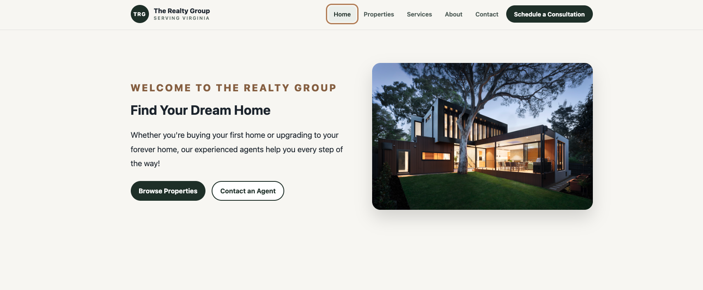

# The Realty Group

A modern, responsive real estate website built with **React** and **Vite** to showcase front-end development skills. The project demonstrates responsive layouts, reusable React components, dynamic routing, searchable property listings, accessible forms, and clean UI design.

---

## Live Demo

**Live Website:**
https://the-realty-group.vercel.app/

**GitHub Repository:**
https://github.com/stevelomax1/realestateproj

---

## Preview




---

## Features

* Responsive design for desktop, tablet, and mobile
* Modern landing page with featured properties
* Search and filter available properties
* Dynamic property details pages
* Schedule a Showing form
* Contact form with validation
* About page
* Services page
* Custom 404 page
* Accessible navigation
* Mobile navigation menu
* Responsive layouts using CSS Grid and Flexbox
* Keyboard accessibility improvements
* Clean, reusable React component architecture

---

## Built With

* React
* Vite
* JavaScript (ES6+)
* React Router
* Lucide React
* HTML5
* CSS3
* Git
* GitHub
* Vercel

---

## Pages

* Home
* Properties
* Property Details
* Services
* About
* Contact
* 404 Not Found

---

## Folder Structure

```text
src/
│
├── assets/
│
├── components/
│   ├── Footer.jsx
│   ├── Navbar.jsx
│   ├── PropertyCard.jsx
│   └── SectionHeading.jsx
│
├── data/
│   └── properties.js
│
├── pages/
│   ├── About.jsx
│   ├── Contact.jsx
│   ├── Home.jsx
│   ├── NotFound.jsx
│   ├── Properties.jsx
│   ├── PropertyDetails.jsx
│   └── Services.jsx
│
├── App.jsx
├── index.css
└── main.jsx
```

---

## Installation

Clone the repository:

```bash
git clone https://github.com/stevelomax1/realestateproj
```

Navigate into the project:

```bash
cd the-realty-group
```

Install dependencies:

```bash
npm install
```

Start the development server:

```bash
npm run dev
```

Open your browser and visit:

```text
http://localhost:5173
```

---

## Build for Production

Create a production build:

```bash
npm run build
```

Preview the production build locally:

```bash
npm run preview
```

---

## Property Data

Property information is stored locally in:

```text
src/data/properties.js
```

Each listing includes:

* Property title
* Price
* City
* State
* Bedrooms
* Bathrooms
* Square footage
* Property type
* Description
* Amenities
* Image
* Featured property status

---

## Accessibility

This project includes:

* Semantic HTML
* Skip-to-content navigation
* Keyboard-friendly navigation
* Visible focus states
* Accessible forms
* Descriptive image alt text
* Reduced-motion support

---

## Future Improvements

Potential future enhancements include:

* Real property API integration
* User authentication
* Favorite properties
* Mortgage calculator
* Interactive maps
* Image galleries
* Agent profile pages
* Backend form submission
* CMS integration

---

## Author

**Steve Lomax**

Front-End Developer

Portfolio: https://www.stevenlomax.com  

GitHub: https://github.com/stevelomax1

LinkedIn: https://linkedin.com/in/stevelomax1

---

## Disclaimer

The Realty Group is a fictional real estate company created as a front-end portfolio project. All properties, statistics, company information, contact information, and services are for demonstration purposes only.
